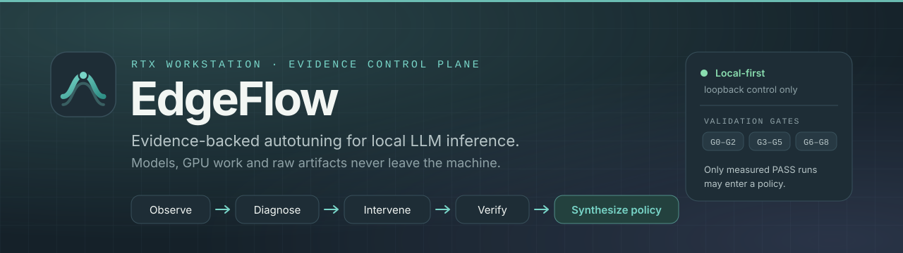
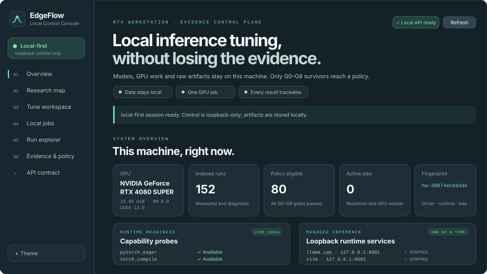
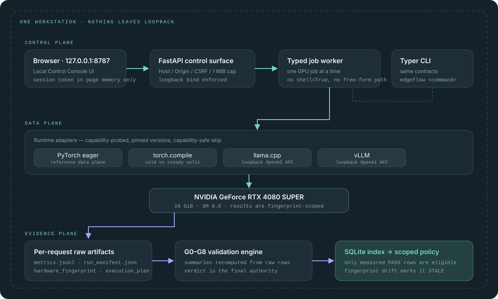
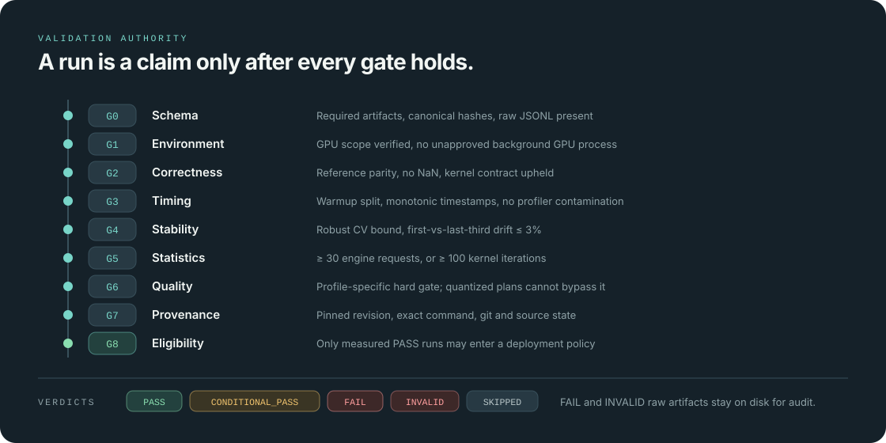

<div align="center">



<p>
  <a href="https://github.com/hanklin9188/EdgeFlow/actions/workflows/ci.yml"></a>
  
  
  
  
  <a href="LICENSE"></a>
</p>

[English](README.md) · **繁體中文** · [文件](docs/) · [實作狀態](docs/IMPLEMENTATION_STATUS.md)

</div>

---

EdgeFlow 把本機 LLM 部署，從「追逐 benchmark 數字」變成一套**可追溯、依 workload 條件化的最佳化流程**。

它不假設某個 runtime 或某種量化永遠最快。EdgeFlow 先保存逐 request 的原始量測，經過 correctness、timing、stability、statistics、quality 與 provenance gate，再用 profiler observation 產生**可反駁**的 bottleneck hypothesis，最後只從通過驗證的 runs 建立 deployment policy。

```
Observe  →  Diagnose  →  Intervene  →  Verify  →  Synthesize policy
```

> [!IMPORTANT]
> `examples/` 與 `ui-prototype/` 永遠標示為 `demo`，不得支持任何性能結論。正式產品是 **localhost-only 的 Local-first Web App**；模型、GPU 工作與 artifacts 都不上雲。在 confirmatory 與 holdout 實驗完成前，本 README **不刊登任何性能數字**。

---

## 與一般 benchmark repo 的差別

| | 一般 benchmark repo | EdgeFlow |
| --- | --- | --- |
| **真實來源** | 一張彙總表 | 逐 request raw JSONL，每次驗證都重新推導 |
| **Workload** | 單一 prompt 長度、單一 batch | 精確 token 分布、concurrency、session 長度都是輸入 |
| **冷啟 vs 穩態** | 混成一個數字 | cold start、compile、capture、steady state 分開保存 |
| **因果** | 看圖說故事 | 一律先是 `HYPOTHESIS`，要 matched intervention + mediator 才升級 |
| **品質** | 註腳，或根本沒有 | 硬性 gate — 量化方案不能用準確度換延遲 |
| **建議** | 「X 比較快」 | 有 scope 的 decision list；fingerprint 一變就回報 `STALE` |

---

## Local Control Console

<div align="center">

</div>

一個指令、一個瀏覽器分頁、一台機器：

```bash
edgeflow serve --host 127.0.0.1 --port 8787
```

Web App 可一鍵啟停固定版本的 llama.cpp／vLLM、建立 workload、screen 候選、提交**一個**受控 GPU benchmark、取消本機 worker，並查看 runtime 能力、run validation、raw artifacts、evidence 與 policy。OpenAPI contract 在 `/openapi.json`，metrics 在 `/metrics`。

`8787` 是 EdgeFlow 的專用預設 port，避免與工作區內其他 localhost 服務混淆。

<details>
<summary><strong>控制平面的安全設計</strong></summary>

- 一次只允許一個 managed runtime 與一個 GPU job。
- Managed runtime 綁定 `127.0.0.1`，使用只存在程序記憶體中的隨機 API key。
- 控制寫入另需只存在分頁記憶體的 token。
- server 拒絕非 loopback host、跨來源寫入、超過 1 MiB 的 request，以及任何由 browser 提供的 shell／path／environment 參數。
- 公開網站不是控制平面。若後續輸出 GitHub Pages，只能包含經清理且 validated 的唯讀 JSON 與圖表。

</details>

---

## 快速開始

**環境需求** — Python 3.11–3.13、NVIDIA driver、CUDA-enabled PyTorch。推薦 WSL2 Ubuntu 或原生 Ubuntu。

```bash
uv sync --extra dev
source .venv/bin/activate
edgeflow doctor
pytest -q
```

GPU data plane 需要現有的 CUDA PyTorch/Transformers 環境，或：

```bash
uv sync --extra dev --extra gpu
```

### 1 · Inspect

*任何量測開始之前，先把機器指紋固定下來。*

```bash
edgeflow inspect
edgeflow inspect --json --output artifacts/hardware_fingerprint.json
edgeflow doctor
```

### 2 · 定義 workload

*prompt 長度、output 長度、concurrency、session 長度都是明確輸入，不是預設值。*

```bash
edgeflow workload create \
  --model smollm2-360m-instruct \
  --profile local-agent \
  --prompt-distribution 32 \
  --output 8 \
  --concurrency 1 \
  --session-requests 30 \
  --save configs/generated/smoke-workload.json
```

`--prompt-distribution` 也支援 `512:0.25,1024:0.45,2048:0.30` 這種混合分布；每次實際 request 都會在**目標 tokenizer** 下精確生成指定 token 數。

### 3 · Screen 候選

*只做 capability／memory／duplicate pruning — 輸出是候選，不是 recommendation。*

```bash
edgeflow tune screen \
  --workload configs/generated/smoke-workload.json \
  --parameter-count 360000000 \
  --save artifacts/planned_candidates.json
```

### 4 · Benchmark

*一次隔離的 run，一個 artifact 目錄。*

```bash
edgeflow benchmark run \
  --model-ref HuggingFaceTB/SmolLM2-360M-Instruct \
  --workload configs/smoke/workload.json \
  --plan configs/smoke/pytorch-eager.json \
  --repetitions 30 \
  --warmup 5 \
  --experiment-id E04
```

```
artifacts/<run_id>/
├── run_manifest.json
├── hardware_fingerprint.json
├── workload.json
├── execution_plan.json
├── metrics.jsonl              ← 逐 request 原始資料
├── stdout.log
├── stderr.log
├── validation_verdict.json
└── VALIDATION.md
```

Formal policy eligibility 還要求 correctness 與 quality artifacts。單純的 latency smoke 預期得到 `CONDITIONAL_PASS`，不會被包裝成完整結論。

### 5 · Validate 與 diagnose

*Profiler-enabled latency 永不覆寫 unprofiled production timing。*

```bash
edgeflow validate artifacts/<run_id>
edgeflow profile --run <run_id> --level nsys
edgeflow diagnose --profile examples/sample_profiler_summary.json
python scripts/verify_results.py
```

### 6 · 驗證 Triton 路徑

*這組 kernel／GPU／dtype／shape 在 cache 中沒有 `PASS` 時，一律走 PyTorch reference。*

```bash
edgeflow kernel validate
edgeflow kernel validate --full
python scripts/benchmark_rmsnorm.py --quick
```

### 7 · 啟動 Console

*選用 llama.cpp／vLLM 前，先建立互不污染的固定版本環境。*

```bash
./scripts/bootstrap_llama_cpp.sh
./scripts/bootstrap_vllm.sh
edgeflow serve --host 127.0.0.1 --port 8787
```

---

## 系統架構

<div align="center">

</div>

控制平面、資料平面與 presentation plane 的完整依賴設計見 [System Architecture](docs/01_SYSTEM_ARCHITECTURE.md)。

---

## Validation gates

<div align="center">

</div>

| Gate | 強制不變式 |
| --- | --- |
| **G0** Schema | 必要 artifacts、schemas、IDs、canonical hashes、raw JSONL |
| **G1** Environment | GPU scope 明確，且沒有未核可的背景 GPU process |
| **G2** Correctness | Reference parity／無 NaN／kernel contract |
| **G3** Timing | Warmup 分離、timestamp 單調、無 profiler 污染 |
| **G4** Stability | Robust CV，且前三分之一 vs 後三分之一 drift ≤ 3% |
| **G5** Statistics | ≥ 30 engine requests，或 ≥ 100 kernel iterations |
| **G6** Quality | 依 profile 的硬性 gate；量化方案不得繞過 |
| **G7** Provenance | 固定 revision、精確指令、git 與 source 狀態 |
| **G8** Eligibility | 只有 measured `PASS` 的 run 能進入 policy |

Verdict 為 `PASS`、`CONDITIONAL_PASS`、`FAIL`、`INVALID`、`SKIPPED`。`FAIL`／`INVALID` 的 raw artifacts 保留供稽核。

---

## 證據與宣稱規則

- `demo`、`estimated`、profiled latency 不可進 headline。
- correctness 或 quality fail 的 plan 永不排名。
- cold start、compile、capture 與 steady state 分開保存。
- engine-only 與 HTTP end-to-end 不在同一 ranking 比較。
- bottleneck diagnosis 是 `HYPOTHESIS`；matched intervention + mediator 才能升級證據。
- runtime／driver／model fingerprint 改變時，policy 回報 `STALE` 並 fallback。
- RTX 4080 SUPER 的結果不外推成多 GPU 或資料中心 GPU 結論。

---

## 已完成，以及尚未成立的部分

**工程面（本 checkout 已完成）**

- RTX 4080 SUPER hardware/software fingerprint 與 environment doctor。
- Pydantic + JSON Schema contracts：workload、plan、manifest、metric、profile、evidence、verdict、policy。
- PyTorch eager／`torch.compile` data plane；llama.cpp／vLLM OpenAI-compatible adapters 與 capability-safe skip。
- 精確 target-tokenizer synthetic prompt、隔離 run artifact、逐 request JSONL、SQLite index。
- G0–G8 validation engine、robust statistics、10,000-sample paired bootstrap、thermal/drift checks。
- Deterministic bottleneck diagnosis、controlled-intervention drafts、session-aware objective 與 decision-list policy。
- Correctness-cached Triton fused residual + RMSNorm，任何未驗證 shape 自動 fallback。
- Typer CLI、localhost FastAPI、隔離背景 worker、白名單 runtime service manager、Prometheus endpoint、無假數據的 Local-first Web App、測試與 CI。

> [!NOTE]
> **研究結論刻意尚未宣稱。** primary 3B 模型的跨 runtime 判定、quality datasets、matched interventions、holdout replay 與 Triton 的 end-to-end 整合，仍需要正式 GPU 實驗。逐 phase 的「工程完成 vs 實驗未完成」對照見 [Implementation Status](docs/IMPLEMENTATION_STATUS.md)。

研究設計完整保留在 [Executive Blueprint](docs/00_EXECUTIVE_BLUEPRINT.md) 與 [Experiment Catalog](docs/03_EXPERIMENT_CATALOG.md)。

---

## Repository map

```
src/edgeflow/
├── api/             localhost FastAPI control/read surface
├── cli/             Typer commands
├── core/            immutable contracts and canonical hashing
├── experiments/     isolated run orchestrator
├── hardware/        RTX/CUDA/software fingerprint + doctor
├── kernels/         correctness-gated Triton optimization
├── local/           typed single-GPU job + allowlisted runtime managers
├── metrics/         robust statistics and paired bootstrap
├── optimizer/       pruning, objectives, break-even
├── policy/          explainable scoped decision lists
├── profiler/        bounded diagnosis rules
├── runtimes/        PyTorch, compile, llama.cpp, vLLM adapters
├── storage/         SQLite migrations and evidence index
├── validation/      G0–G8 final authority
└── workloads/       exact-token controlled inputs
```

---

## CLI 一覽

```
edgeflow inspect [--json]
edgeflow doctor [--strict-optional]
edgeflow workload create ...
edgeflow tune screen --workload ...
edgeflow benchmark run --model-ref ... --workload ... --plan ...
edgeflow experiment plan E05
edgeflow profile --run <run_id> --level torch|nsys|ncu
edgeflow diagnose --profile <profiler_summary.json>
edgeflow validate <artifact_dir>
edgeflow policy build --results <eligible_rows.json> ...
edgeflow policy show <policy.json>
edgeflow kernel validate [--full]
edgeflow serve
```

---

## 文件

| | |
| --- | --- |
| [00 · Executive Blueprint](docs/00_EXECUTIVE_BLUEPRINT.md) | 專案為何存在、什麼才算成功 |
| [01 · System Architecture](docs/01_SYSTEM_ARCHITECTURE.md) | 控制／資料／呈現平面 |
| [02 · Experiment Master Plan](docs/02_EXPERIMENT_MASTER_PLAN.md) | E00–E30 如何串接 |
| [03 · Experiment Catalog](docs/03_EXPERIMENT_CATALOG.md) | 每個實驗的假設與 exit criteria |
| [05 · Autotuning & Causal Method](docs/05_AUTOTUNING_AND_CAUSAL_METHOD.md) | intervention、mediator、policy synthesis |
| [06 · Profiling & Kernel Plan](docs/06_PROFILING_AND_KERNEL_PLAN.md) | Nsight 流程與 Triton 路徑 |
| [07 · Validation & Statistics](docs/07_VALIDATION_AND_STATISTICS.md) | gates、robust statistics、paired bootstrap |
| [09 · UI/UX & Presentation](docs/09_UI_UX_GITHUB_PRESENTATION.md) | 設計語言與呈現規則 |
| [11 · Reproducibility & Security](docs/11_REPRODUCIBILITY_RELEASE_SECURITY.md) | 釋出、provenance 與資料處理 |
| [Implementation Status](docs/IMPLEMENTATION_STATUS.md) | 工程完成 vs 實驗未完成 |

---

## 開發

```bash
ruff check src tests
pytest -q
python scripts/validate_package.py
python scripts/verify_results.py
```

Public CI 不需要 GPU，只驗證 schemas、tests、lint 與 secret／model-weight policy。完整 GPU sweep 透過 self-hosted runner 或本機執行。歡迎貢獻，請見 [CONTRIBUTING.md](CONTRIBUTING.md)。

---

## 安全與資料

不提交模型權重、token、`.env`、gated prompt 原文、Nsight binary trace 或 private artifacts。HTTP adapters 只允許 loopback OpenAI-compatible endpoint；正式 run 不使用 `shell=True`，也不在 benchmark 過程安裝套件。詳見 [SECURITY.md](SECURITY.md) 與 [Reproducibility](docs/11_REPRODUCIBILITY_RELEASE_SECURITY.md)。

---

## 授權與引用

EdgeFlow 原始碼採 [Apache License 2.0](LICENSE)。模型、資料集與 runtime 保留各自授權；正式 run 必須記錄 revision 與條款。引用資訊見 [CITATION.cff](CITATION.cff)。

<div align="center">
<sub>在單張 NVIDIA GeForce RTX 4080 SUPER 工作站上建置與驗證。</sub>
</div>
