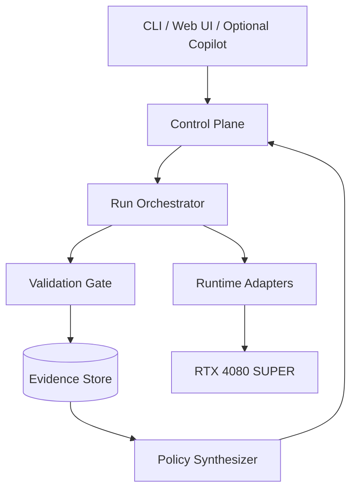

# 01 · System Architecture

## 1.1 架構原則

EdgeFlow 採用「控制平面與資料平面分離」：

- **Data plane**：實際載入模型、執行 inference、收集時間與 trace。
- **Control plane**：產生候選 plan、安排實驗、驗證結果、更新 evidence graph。
- **Presentation plane**：CLI、API、Dashboard、可選 Copilot。

LLM／Agent 不得位於 data plane 的量測迴圈內，避免污染 GPU、CPU、記憶體與 timing。



---

## 1.2 主要模組

### A. Hardware Inspector

責任：建立硬體與軟體 fingerprint，作為所有結果的不可省略前置資訊。

必要欄位：

- GPU name、UUID、compute capability、VRAM。
- NVIDIA driver、CUDA runtime、CUDA toolkit。
- power limit、temperature、graphics/SM/memory clock。
- CPU、核心數、RAM、OS、WSL/native。
- Python、PyTorch、Transformers、Triton。
- llama.cpp commit/build flags。
- vLLM version/build environment。
- Nsight Systems／Compute version。
- git commit、dirty state、config hash。

輸出：`hardware_fingerprint.json`。

### B. Model Registry

責任：定義每個模型可使用的格式與 backend，而不是在程式中散落判斷。

每個 entry 需包含：

- canonical model ID；
- architecture family；
- parameter count；
- context limit；
- license／gating；
- tokenizer revision；
- HF BF16/FP16 source；
- GGUF source或 conversion recipe；
- backend support state：`verified / experimental / unsupported / pending`；
- expected VRAM tier；
- chat template；
- thinking／reasoning switch；
- quality evaluation protocol。

正式 run 必須鎖定 model revision 或 file hash。

### C. Workload Builder

輸入可以是：

1. 固定 token bucket；
2. dataset prompt；
3. real-distribution sample；
4. arrival trace。

輸出 `WorkloadSpec`：

```python
@dataclass(frozen=True)
class WorkloadSpec:
    workload_id: str
    model_id: str
    prompt_source: str
    prompt_tokens: int
    output_tokens: int
    batch_size: int
    concurrency: int
    arrival_pattern: str
    request_rate: float | None
    sampling: str
    seed: int
    streaming: bool
    session_requests: int
```

控制 token length 時，必須在**目標模型 tokenizer**下確認實際 token 數，而不是用字元數估計。

### D. Runtime Adapter

統一介面：

```python
class RuntimeAdapter(Protocol):
    name: str

    def probe(self) -> CapabilityReport: ...
    def prepare(self, model: ModelSpec, plan: ExecutionPlan) -> PreparedRuntime: ...
    def warmup(self, workload: WorkloadSpec) -> WarmupReport: ...
    def generate(self, request: RequestSpec) -> GenerationRecord: ...
    def benchmark(self, workload: WorkloadSpec) -> RawRunArtifacts: ...
    def profile(self, workload: WorkloadSpec, level: str) -> ProfileArtifacts: ...
    def memory_snapshot(self) -> MemoryRecord: ...
    def shutdown(self) -> None: ...
```

共同語意：

- `prepare` 與 `warmup` 不計入 steady-state latency，但需另行量測。
- `generate` 必須回傳 token timestamps，而不是只回總時間。
- 每個 adapter 必須提供 native metrics 與 EdgeFlow normalized metrics。
- adapter 不得偷偷改 prompt template、EOS、sampling 或 max tokens。

### E. Run Orchestrator

責任：

- 產生 run order；
- randomize matched plan pair；
- 冷／熱 run 分離；
- subprocess isolation；
- timeout、OOM、crash recovery；
- GPU idle precondition；
- thermal stabilization；
- 收集 stdout/stderr；
- 寫入 run manifest；
- 送入 Validation Gate。

每個正式 configuration 建議獨立 process，避免 allocator、compile cache、fragmentation 相互污染。需要共享 cache 的實驗必須明示。

### F. Metric Engine

標準化指標：

- model load time；
- compile／autotune time；
- warmup time；
- TTFT；
- TPOT；
- per-token ITL；
- request latency；
- prompt processing tok/s；
- generation tok/s；
- aggregate tok/s；
- requests/s；
- queue delay；
- peak VRAM allocated/reserved；
- process RSS；
- GPU power／energy（可取得時）；
- failure／timeout／fallback count。

### G. Profiler Adapter

三級 profiling：

| Level | 工具 | 用途 | 是否用於正式 latency |
|---|---|---|---|
| L0 | internal timers + CUDA events | 低干擾 timing | 是 |
| L1 | `torch.profiler` / runtime native | operator、CUDA activity | 否 |
| L2 | Nsight Systems | CPU/GPU timeline、launch gap、memcpy | 否 |
| L3 | Nsight Compute | 個別 kernel、memory/compute metrics | 否 |

Profiler 產生的數字用於 diagnosis，不與 unprofiled latency 混合。

### H. Bottleneck Diagnoser

第一版採 deterministic rule engine；輸入 normalized trace summary，輸出：

```json
{
  "candidate_bottlenecks": [
    {
      "label": "launch_overhead_bound",
      "confidence": 0.82,
      "evidence": ["kernel_gap_ratio=0.28", "median_kernel_us=7.4"]
    }
  ],
  "recommended_interventions": [
    "torch_compile_reduce_overhead",
    "cuda_graph_capture",
    "operator_fusion"
  ]
}
```

不得輸出沒有對應 evidence field 的結論。

### I. Candidate Generator

生成 execution plan 空間：

```text
backend
× precision / quantization
× compile mode
× static/dynamic shape
× batch/token budget
× CUDA graph
× attention backend
× KV-cache dtype
× custom kernel dispatch
```

先用 capability 與 memory model 剪枝，再執行量測。

### J. Validation Gate

所有 plan 必須依序通過：

```text
Schema → Environment → Correctness → Stability → Statistics → Quality → Provenance
```

失敗 plan 仍保留 raw artifacts，但不得進入 recommendation。

### K. Evidence Store

建議第一版使用 SQLite + 檔案 artifact store：

```text
runs.sqlite
artifacts/
  <run_id>/
    manifest.json
    metrics.jsonl
    stdout.log
    stderr.log
    trace/
    validation.json
```

核心表：

- `hardware`；
- `models`；
- `workloads`；
- `plans`；
- `runs`；
- `metrics`；
- `validation`；
- `hypotheses`；
- `interventions`；
- `evidence_edges`；
- `policies`。

### L. Policy Synthesizer

輸出不是一個 plan，而是有明確 scope 的規則：

```json
{
  "policy_id": "rtx4080s-ministral3-3b-interactive-v1",
  "rules": [
    {
      "when": {"prompt_tokens_lte": 1024, "concurrency_lte": 1},
      "plan_id": "pt-compile-ro-bf16",
      "evidence_ids": ["ev-001", "ev-009"]
    },
    {
      "when": {"prompt_tokens_gt": 1024, "concurrency_lte": 1},
      "plan_id": "llamacpp-q6",
      "evidence_ids": ["ev-022"]
    }
  ],
  "fallback_plan_id": "pytorch-eager-bf16"
}
```

任何 rule 都要附：

- valid workload range；
- expected objective；
- uncertainty；
- supporting run IDs；
- quality status；
- software version scope。

---

## 1.3 ExecutionPlan

建議資料模型：

```python
@dataclass(frozen=True)
class ExecutionPlan:
    plan_id: str
    backend: str
    model_format: str
    dtype: str | None
    quantization: str | None
    compile_mode: str | None
    dynamic_shapes: bool | None
    fullgraph: bool | None
    cuda_graph: bool | None
    max_num_batched_tokens: int | None
    max_num_seqs: int | None
    kv_cache_dtype: str | None
    flash_attention: bool | None
    custom_kernel_set: tuple[str, ...]
    backend_args: dict[str, object]
```

Plan 必須 canonicalize 後 hash；避免同一設定因 argument order 不同產生不同 ID。

---

## 1.4 Timing 邊界

### Engine-only

```text
pre-tokenized IDs available
        ↓
backend enqueue
        ↓
first output token
        ↓
last output token
```

### End-to-end

```text
HTTP request accepted
        ↓
JSON parse
        ↓
tokenization
        ↓
queue
        ↓
inference
        ↓
sampling
        ↓
stream / serialization complete
```

兩種數字不得混稱「latency」。UI 必須在 metric label 上明示。

---

## 1.5 Windows／WSL2 部署拓撲

推薦：

```text
Windows 11 Host
├── NVIDIA display driver
├── Browser / VS Code / UI
└── WSL2 Ubuntu
    ├── Python env
    ├── CUDA-enabled PyTorch
    ├── Triton
    ├── llama.cpp CUDA build
    ├── vLLM
    ├── Nsight Compute CLI
    └── EdgeFlow service
```

注意事項：

- WSL2 內不要安裝另一套 Windows display driver。
- GPU performance counter 需在 Windows NVIDIA Control Panel 允許，否則 Nsight Compute 可能無權限。
- `nvidia-smi`、PyTorch CUDA smoke、Triton smoke、Nsight permission 必須分開驗證。
- 若 WSL2 profiler 功能不足，正式 timeline 可用 native Windows Nsight Systems；run manifest 要標記 profiler host mode。

---

## 1.6 Failure Isolation

每個 run 狀態：

```text
PLANNED
PRECHECK_FAILED
PREPARING
WARMING
RUNNING
PROFILED
VALIDATING
PASSED
CONDITIONAL_PASS
FAILED
INVALID
CANCELLED
```

OOM、CUDA illegal memory access、backend crash 後必須終止 subprocess；不能在同一 Python process 繼續正式 run。

---

## 1.7 API 草案

```text
POST /api/v1/inspect
POST /api/v1/experiments
GET  /api/v1/experiments/{id}
POST /api/v1/runs
GET  /api/v1/runs/{id}
POST /api/v1/compare
POST /api/v1/tune
GET  /api/v1/policies/{id}
GET  /api/v1/evidence/{id}
GET  /metrics
GET  /health
```

Dashboard 只讀 raw artifacts 與 normalized API，不直接解析 backend-specific logs。

---

## 1.8 建議 repository 實作結構

```text
edgeflow/
├── cli/
├── api/
├── hardware/
├── models/
├── workloads/
├── runtimes/
│   ├── base.py
│   ├── pytorch_eager.py
│   ├── torch_compile.py
│   ├── llama_cpp.py
│   └── vllm.py
├── metrics/
├── profiler/
├── diagnosis/
├── experiments/
├── validation/
├── optimizer/
├── policy/
├── evidence/
├── kernels/
├── reports/
└── storage/
```

模組依賴方向應保持：

```text
schemas ← core ← runtime/profiler ← experiment ← validation ← optimizer/policy ← UI
```

UI、Agent 不得反向成為 benchmark core 的必要依賴。
