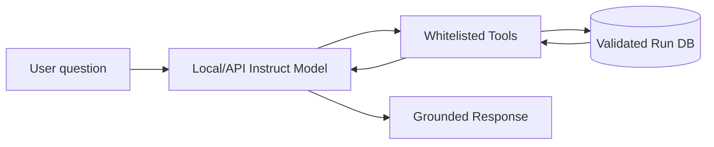

# 08 · Optional Performance Copilot

## 8.1 定位

Copilot 不是 EdgeFlow 的創新核心，也不是 benchmark authority。它是：

> 一個只讀取已驗證 evidence、能把自然語言意圖轉為 workload、解釋結果並提出下一個受控實驗的介面。

名稱建議：**EdgeFlow Performance Copilot**。

---

## 8.2 何時加入

只有當以下完成後才加入：

- run schema stable；
- validation gate stable；
- evidence graph stable；
- deterministic tune可用；
- UI可不靠Copilot完成全部任務。

Copilot不得成為MVP阻塞項。

---

## 8.3 架構



模型只取得tool output，不直接查任意檔案或執行shell。

---

## 8.4 工具白名單

```text
resolve_workload_intent
list_validated_runs
get_run_summary
compare_runs
get_evidence_chain
list_policy_rules
estimate_break_even
propose_controlled_intervention
create_experiment_draft
render_report
```

所有 tool input依JSON Schema驗證。

禁止：

- arbitrary shell；
- package install；
- driver change；
- model delete；
- power limit change；
- benchmark run without explicit user action；
- 任意寫入evidence。

---

## 8.5 狀態機

```text
UNDERSTAND_INTENT
      ↓
FETCH_EVIDENCE
      ↓
CHECK_SUFFICIENCY
  ┌───┴────┐
ENOUGH   INSUFFICIENT
  ↓          ↓
ANSWER   PROPOSE EXPERIMENT
  ↓          ↓
CITE RUNS  WAIT FOR EXPLICIT RUN
```

若資料不足，必須回答「目前沒有足夠實驗」，而不是用一般知識補數字。

---

## 8.6 模型

候選：

- `Qwen/Qwen3.5-4B`，thinking disabled；
- 其他支援structured output的3–4B instruct model；
- 外部API可選。

本機GPU只有16GB時，Copilot與受測runtime不能同時駐留。策略：

1. benchmark完成後卸載受測模型，再載入Copilot；
2. Copilot用GGUF Q4 CPU/GPU混合；
3. UI server與benchmark worker分process；
4. 或使用外部API，但不把private prompt送出。

---

## 8.7 不需訓練

初版使用prompt + tools + schema即可。Fine-tuning不是必要。

若後續做tool-use SFT：

- synthetic records；
- 完全不含真實private prompts；
- 每筆包含question、available evidence、correct tool call、grounded answer；
- 數字來自模板注入；
- train/validation按experiment template group split；
- 評估numeric fidelity與refusal。

---

## 8.8 回答格式

Copilot輸出應有：

```text
Conclusion
Measured evidence
Interpretation
Uncertainty
Recommended next experiment
Run references
```

每句關鍵敘述標籤：

- `MEASURED`
- `INFERRED`
- `HYPOTHESIS`
- `NOT AVAILABLE`

---

## 8.9 Evaluation

測試集至少100題：

- 數字查詢；
- plan比較；
- cold/steady混淆；
- quality fail；
- invalid run；
- insufficient evidence；
- malicious prompt要求編數字／執行shell。

指標：

- numeric exactness；
- run citation coverage；
- unsupported claim rate；
- invalid-run leakage；
- correct refusal；
- experiment proposal schema validity。

公開啟用門檻：

- fabricated numeric claim = 0；
- invalid run當證據 = 0；
- tool schema validity ≥99%；
- evidence citation ≥95%。

---

## 8.10 Agent 與核心的界線

```text
Copilot can suggest.
Validation can approve.
Measured runs can decide.
```

這句可直接放在UI的Copilot頁面。
