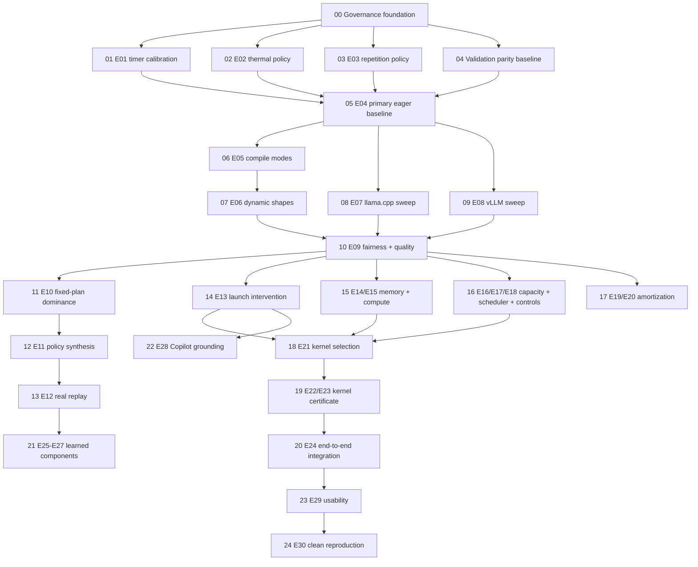

# 18 · Ordered Execution Backlog

This backlog converts E01–E30 into dependency-aware tracer-bullet work. Each ticket delivers one complete, verifiable capability rather than one horizontal code layer.

## Dependency map



---

## 00 — Establish agent and experiment governance

**Blocked by:** None.

**What it delivers:** Shared language, ADRs, issue workflow, skill operating model, machine-readable validation parity, and governance CI.

**Acceptance criteria:**

- `AGENTS.md` and `CONTEXT.md` exist.
- At least the six initial ADRs are present.
- `specs/validation_requirements.yaml` passes the audit.
- Governance contract tests pass.
- Formal experiment issue and PR templates exist.

**Commands:**

```bash
python scripts/audit_validation_parity.py
pytest -q tests/test_governance_contract.py
```

---

## 01 — Calibrate timer boundaries (E01)

**Blocked by:** 00.

**What it delivers:** A documented, tested distinction among CUDA event time, synchronized wall time, and end-to-end time.

**Execution:**

- CPU sleep control.
- CUDA vector operation.
- Small GEMM.
- 1,000 iterations for each timer/synchronization pair.
- Include incorrect no-sync measurement as a negative control.

**Artifacts:**

- `timer_calibration.json`;
- raw rows;
- timer-boundary diagram;
- selected measurement policy;
- validation verdict.

**Acceptance:**

- unsynchronized bias is demonstrated and prohibited;
- selected boundaries have quantified overhead and stable ordering;
- engine and end-to-end labels are unambiguous;
- timing-code changes trigger this fixture.

---

## 02 — Establish thermal and background-load policy (E02)

**Blocked by:** 00.

**What it delivers:** Empirically justified preconditions for formal RTX 4080 SUPER runs.

**Execution:**

- cold start;
- stabilized idle;
- browser-video control;
- deliberate background CUDA negative control;
- sustained load block.

**Artifacts:**

- clock, temperature, power, utilization series;
- latency series;
- `measurement_policy.yaml`.

**Acceptance:**

- selected thresholds distinguish stable and contaminated blocks;
- invalid background conditions are rejected by validator/precheck;
- rerun policy is explicit.

---

## 03 — Select repetition policy (E03)

**Blocked by:** 00 and timer fixture from 01 for final acceptance.

**What it delivers:** Evidence-based minimum repetitions by run type.

**Execution:**

- create a 200-request reference block;
- repeatedly subsample 10, 20, 30, and 50 rows;
- evaluate median error, CI width, and winner reversal.

**Acceptance:**

- selected count keeps winner reversal below 5% for the target comparison class;
- kernel, engine, and online-tail protocols are allowed separate minima;
- policy is versioned and used by validator.

---

## 04 — Close validation specification/implementation gaps

**Blocked by:** 00.

**What it delivers:** Hard rules in the validation skill are backed by code and regression tests.

**First closure set:**

1. exact workload/token parity;
2. same-precision runtime correctness metrics;
3. quality artifact schema and recomputation;
4. search/holdout role enforcement;
5. causal mediator/outcome promotion;
6. scoped public-claim audit.

**Acceptance per rule:**

- requirement status becomes `implemented`;
- enforcement path exists;
- red fixture fails before implementation;
- green fixture passes after implementation;
- negative fixture prevents policy/public eligibility;
- audit and full CI pass.

---

## 05 — Establish primary 3B PyTorch eager reference (E04)

**Blocked by:** 01, 02, 03, 04.

**What it delivers:** Correctness, quality, memory, and performance reference for later comparisons.

**Matrix:**

- prompt: 128, 1,024, 4,096;
- output: 32, 128;
- batch: 1, 4 where supported;
- BF16;
- greedy;
- pinned primary 3B model and tokenizer.

**Acceptance:**

- every supported row has raw records and full fingerprint;
- correctness and quality baselines pass;
- stability and repetition gates pass;
- unsupported/OOM regions are capacity results, not omitted rows.

---

## 06 — Measure torch.compile modes and session costs (E05)

**Blocked by:** 05.

**What it delivers:** A validated comparison of eager, default, reduce-overhead, max-autotune, and max-autotune-no-cudagraphs.

**Acceptance:**

- compile, autotune, capture, and steady costs are separated;
- graph breaks and recompiles are recorded;
- session horizons 1/5/20/100/1,000 are computed from measured components;
- a steady-vs-session crossover is reported or a null result is documented.

---

## 07 — Validate dynamic-shape and bucket behavior (E06)

**Blocked by:** 06.

**What it delivers:** A decision between static specialization, dynamic graphs, and EdgeFlow shape buckets.

**Sequence:** `128 → 128 → 1024 → 128 → 2048 → 1024 → 4096`.

**Acceptance:**

- compile/recompile events and latency spikes are captured;
- bucket padding cost and cache reuse are measured;
- resulting rule is scoped to observed lengths and versions.

---

## 08 — Complete primary llama.cpp quantization/quality sweep (E07)

**Blocked by:** 05 and quality enforcement from 04.

**What it delivers:** Validated latency-memory-quality Pareto rows, not a presumption that Q4 is best.

**Plans:** Q8_0, Q6_K, Q5_K_M, Q4_K_M; F16/BF16 where feasible.

**Acceptance:**

- GGUF provenance and tokenizer/template parity documented;
- WikiText-2 and ARC-C gates executed under the same protocol;
- quality failures remain visible but policy-ineligible;
- all comparisons use matched workload boundaries.

---

## 09 — Complete primary 3B vLLM scheduling sweep (E08)

**Blocked by:** 05.

**What it delivers:** Workload-scoped scheduling choices under concurrency and mixed prefill/decode.

**Acceptance:**

- primary 3B model, not only smoke model;
- token budgets and max sequence counts are varied;
- queue, TTFT, ITL, throughput, preemption, and OOM are recorded;
- at least two workload buckets are compared.

---

## 10 — Certify cross-runtime fairness and quality (E09)

**Blocked by:** 07, 08, 09.

**What it delivers:** The set of cross-runtime pairs that are legitimately comparable.

**Acceptance:**

- prompt token IDs, templates, BOS/EOS, sampling, output limits, and timing boundaries audited;
- weight/checkpoint relationship documented;
- incompatible pairs are excluded with reason;
- fairness artifact is required by policy eligibility for cross-runtime claims.

---

## 11 — Test fixed-plan dominance (E10)

**Blocked by:** 10.

**What it delivers:** Quantified evidence for or against the need for workload-conditioned policy.

**Acceptance:**

- strongest validated fixed plan identified without holdout leakage;
- oracle bucket policy and fixed-plan regret computed;
- practical policy gain threshold preregistered;
- null result is accepted if one plan dominates.

---

## 12 — Compare policy synthesis baselines (E11)

**Blocked by:** 11.

**What it delivers:** An explainable policy that is at least as good as the strongest simple baseline on held-out buckets.

**Baselines:** global winner, hand rule, decision tree, nearest-neighbor, evidence-constrained decision list.

**Acceptance:**

- expected objective, p95, violations, complexity, fallback, and oracle regret reported;
- every rule points to eligible runs;
- sparse regions use fallback.

---

## 13 — Replay real workload distribution (E12)

**Blocked by:** 12.

**What it delivers:** External-validity evidence using real prompt/turn-length distributions.

**Acceptance:**

- sampling seed and dataset revision pinned;
- private/gated text handling follows terms;
- policy direction holds or distribution shift is explained;
- real replay is not used to retune the frozen policy.

---

## 14 — Validate launch-overhead diagnosis (E13)

**Blocked by:** 10.

**What it delivers:** One complete observation→hypothesis→intervention→mediator→outcome chain.

**Acceptance:**

- profiler shows multiple independent launch indicators;
- intervention changes the intended launch mediator;
- unprofiled TPOT improvement passes practical/CI threshold;
- negative or alternative explanation is evaluated.

---

## 15 — Validate memory and compute diagnoses (E14–E15)

**Blocked by:** 10.

**What it delivers:** Distinct evidence for decode memory behavior and prefill compute behavior.

**Acceptance:**

- memory experiment measures bytes/traffic proxy and quality impact;
- compute experiment measures prefill kernel composition and utilization;
- interventions target different mediators;
- claims remain scoped to workload phase.

---

## 16 — Validate capacity, scheduling, and negative controls (E16–E18)

**Blocked by:** 10.

**What it delivers:** RTX 4080 SUPER capacity map, mixed-workload scheduling analysis, and diagnoser false-positive checks.

**Acceptance:**

- context×concurrency capacity map with safety headroom;
- mixed workload reports tail latency and starvation;
- at least one irrelevant intervention is rejected or marked inconclusive.

---

## 17 — Establish cold/warm/session break-even policy (E19–E20)

**Blocked by:** 05–10.

**What it delivers:** Deployment recommendations that account for load, compile, capture, and request horizon.

**Acceptance:**

- process cold, file-cache warm, compile-cache warm, and steady states are distinct;
- break-even uncertainty is reported;
- policy may choose a slower steady plan for short sessions when total cost is lower.

---

## 18 — Select the formal kernel target (E21)

**Blocked by:** 14, 15, 16.

**What it delivers:** A profiler-backed candidate ranking.

**Acceptance:**

- candidates scored by time share, frequency, fusion opportunity, and feasibility;
- existing RMSNorm prototype is accepted only if it wins or retained explicitly as an engineering demo;
- selected target and expected upper bound are documented.

---

## 19 — Certify kernel region and heatmap (E22–E23)

**Blocked by:** 18.

**What it delivers:** Correctness certificate, slower/faster regions, and safe dispatch.

**Acceptance:**

- awkward shapes, dtypes, layouts, extreme values, determinism, and fallback tested;
- at least 100 iterations per performance region;
- complete heatmap published, including regressions;
- only certified regions dispatch to custom kernel.

---

## 20 — Confirm end-to-end kernel impact (E24)

**Blocked by:** 19.

**What it delivers:** Honest model-level effect and overhead accounting.

**Acceptance:**

- ON/OFF model runs are matched and unprofiled;
- Amdahl upper bound is discussed;
- correctness, quality, memory, and stability pass;
- no headline if effect is neutral or below threshold.

---

## 21 — Add learned components only when justified (E25–E27)

**Blocked by:** sufficient independent database after 13–17.

**What it delivers:** Optional cost-model pruning and bottleneck classification without replacing measurement.

**Acceptance:**

- at least the preregistered number of independent plan-workload points;
- grouped, workload-range, model-family, and temporal splits;
- top-k recall and selection regret beat deterministic baseline;
- uncertainty and fallback remain active.

---

## 22 — Ground the Performance Copilot (E28)

**Blocked by:** validated evidence records and at least one causal chain.

**What it delivers:** Natural-language explanation that never invents metrics.

**Acceptance:**

- unsupported numeric claim count is zero;
- every number cites a run ID;
- measured, inferred, and hypothesis statements are distinguished;
- insufficient evidence produces refusal.

---

## 23 — Audit UI usability (E29)

**Blocked by:** stable evidence surfaces and policy UI.

**What it delivers:** Proof that users can trace a recommendation to evidence and distinguish claim states.

**Acceptance:**

- at least five relevant participants;
- tasks cover plan selection, invalid run, raw trace, cold/steady winner, and causal evidence;
- task success, time, and misinterpretation rates reported;
- critical misunderstanding is fixed and retested.

---

## 24 — Reproduce on a clean environment (E30)

**Blocked by:** release candidate and 23.

**What it delivers:** Evidence that hidden local state is not required.

**Acceptance:**

- second machine or genuinely clean environment;
- documented setup path only;
- smoke model, one runtime, one formal artifact, validator, and dashboard all work;
- deviations and unsupported capabilities are documented.
