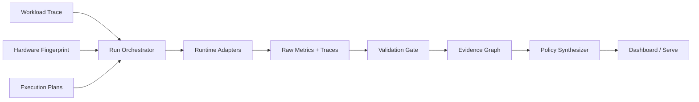

# EdgeFlow

> **Causal, workload-conditioned autotuning for local LLM inference.**

[Local Web Console](#local-first-web-app) · `docs/REPRODUCE.md` · `docs/METHOD.md` · `docs/RESULTS.md` · `docs/AUDIT.md`

> [!IMPORTANT]
> Replace every `DEMO` placeholder below with a validated measured artifact before public release. A headline metric must link to a run ID and a validation verdict.


## Why EdgeFlow?

The fastest steady-state configuration is not necessarily the fastest deployment. EdgeFlow measures model loading, compilation, graph capture, request latency, memory, and quality on the target GPU; diagnoses the active bottleneck; validates optimization hypotheses with matched interventions; and emits a workload-conditioned deployment policy.

```text
Observe → Diagnose → Intervene → Verify → Synthesize Policy
```

## Headline result card

| Hardware | Model | Workload distribution | Best fixed plan | EdgeFlow policy | Relative session cost | Evidence |
|---|---|---|---|---|---:|---|
| RTX 4080 SUPER | `MODEL` | `TRACE` | `PLAN` | `POLICY` | `MEASURED` | [`RUN_IDS`](#) |

Do not show only the winning bucket. Include expected cost over the complete preregistered workload distribution and per-bucket regret.

## What is technically new?

1. **Workload-conditioned policy** — chooses a plan by prompt length, output length, concurrency, arrival pattern, and expected session size.
2. **Causal intervention loop** — turns profiler observations into matched experiments and records supported, rejected, or inconclusive hypotheses.
3. **Amortization-aware objective** — includes model load, compilation, autotuning, graph capture, and steady-state request costs.
4. **Correctness-gated optimization** — invalid plans never enter policy ranking.

## System map



## Reproducible quick start

```bash
# 1. Capture the exact environment
edgeflow inspect --output runs/hardware.json

# 2. Probe backend/model compatibility
edgeflow probe --model MODEL_ID --backends pytorch,compile,llama-cpp,vllm

# 3. Run the preregistered screening matrix
edgeflow experiment run --matrix configs/screening.yaml

# 4. Validate before ranking
edgeflow validate runs/<RUN_ID>

# 5. Synthesize and hold out a policy
edgeflow policy fit --runs runs/index.sqlite --config configs/policy.yaml
edgeflow policy evaluate --policy policies/<POLICY_ID>.json --split holdout
```

## Evidence, not screenshots

Every chart point must expose:

- run ID;
- source type (`measured`, `demo`, or `estimated`);
- model/tokenizer revision;
- hardware fingerprint;
- exact workload and plan;
- raw artifacts;
- validation verdict.

## Repository map

```text
edgeflow/
├── edgeflow/              production Python package
├── kernels/               Triton kernels and references
├── configs/               pinned experiment definitions
├── benchmarks/            workload builders and harnesses
├── tests/                 unit, contract, correctness, smoke
├── results/               compact validated public artifacts
├── dashboard/             static evidence explorer
├── docs/                  method, protocol, results, audit
└── scripts/               setup, capture, reproduce, release
```

## Validation status

| Gate | Status | Artifact |
|---|---|---|
| Schema and provenance | `STATUS` | `LINK` |
| Same-precision correctness | `STATUS` | `LINK` |
| Quantization quality | `STATUS` | `LINK` |
| Timing integrity | `STATUS` | `LINK` |
| Thermal/stability | `STATUS` | `LINK` |
| Policy holdout | `STATUS` | `LINK` |

## Honest boundaries

- First release targets one RTX 4080 SUPER and does not claim datacenter-GPU generalization.
- Profiled timings are diagnostic, not production latency.
- Cross-runtime comparisons require tokenizer, template, sampling, prompt IDs, and output protocol parity.
- Optional Copilot explains validated data; it cannot approve a run or invent a metric.

## License and model terms

Project code license: `CHOOSE_LICENSE`. Model weights and datasets remain under their upstream terms and are not redistributed.
